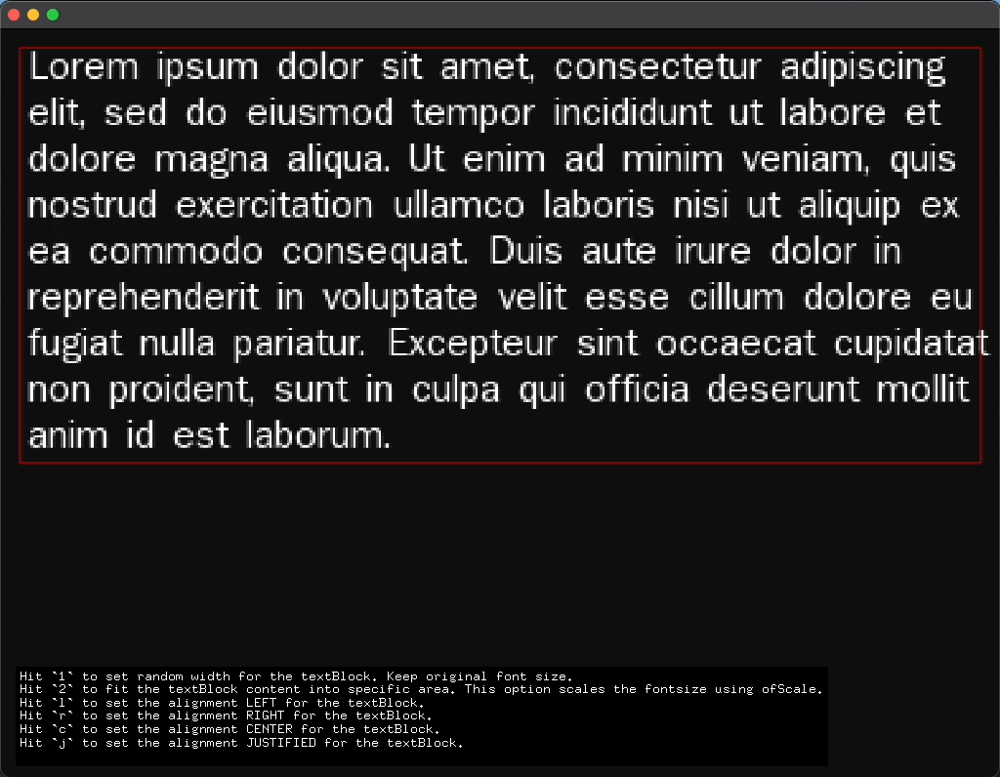
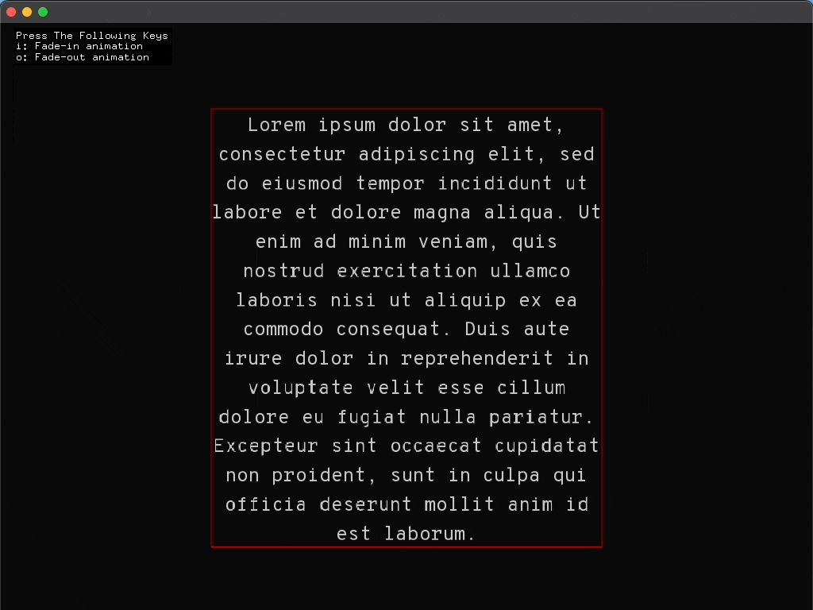

# ofxTextSuite

ofxTextSuite is an openFrameworks addon aims to ease the process of text creation and manipulation. 

> [!IMPORTANT]  
> The addon is still work in progress. I will add more examples showcasing new features. 

# Examples
The major update for the examples is setting the position of textBlock. Formerly, you had to update the position according to the alignment. Since, the user defines the `textBlock` width in the `setup()` method, now, all of the content stays within the boundaries of the predefined values. No need to update position according to the alignmnet choice. 

## example (basic)
Presents all of the fundamental features of the addon. I try to keep the code backwards compatiblity as much as possible. If you used my fork all the time, you may only need to update position according to the alignment of the textBlock. 

## example-textAnimation (basic)
Presents how to animate the content of the textBlock. The following feature would be usefull for button animations, header like texts or any other dynamic content. There are two types of animation namely "fadein" and "fadeout." Scroll down to the `keyPressed()` function in the source code. The [ofxTweenzor]() is already bundled with the `ofxTextSuite`. So there is no need to import the library during the project generation. It will be included by default. 

# Features
- Fit text into a specific width and height area.
- Set the text alignment left, right, center, and justified.
- Animate text via fade in/out effect. ~~This feature requires [ofxTweenzor](https://github.com/NickHardeman/ofxTweenzor).~~ 
- Use multiple fonts in a single textblock object via tags similar to html markup language.
- Use ofxTextSuite's font loader by passing the font location as argument.
- Use a preloaded ofTrueTypeFont variable to draw text with ofxTextSuite. This is useful for using custom fonts loaded with specific character ranges in your project.

# Background
This project has been transferred to [Furkan Üzümcü](https://github.com/Furkanzmc) from [Luke Malcolm](https://github.com/lukemalcolm). Furkan transferred the project to me at last. Thanks to contributors, maintainers and creators of the addon.

# To do
- [x] ~~Fix positioning issues when the user set alignment on the fly.~~
- [x] ~~Add fade in/out animated text example.~~
- [ ] Add preloaded font example.
- [ ] Add html-based example to use custom styles via markup tags.
- [ ] Handle alignment without using draw method. Include the alignment as an argument.
